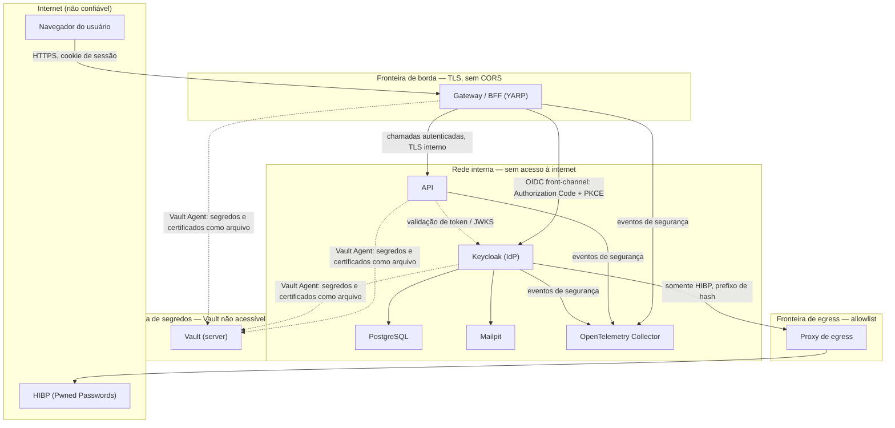

# Arquitetura

> Este documento descreve a arquitetura alvo consolidada do SecureBaseline: os componentes que existirão ao final dos marcos M1–M4, os fluxos entre eles e as fronteiras de confiança que atravessam. Cada change (PRD) implementa uma fatia deste desenho; nenhuma peça aqui é hipotética além do que os PRDs já especificam.

## Propósito do sistema

Baseline de referência para uma API de instituição financeira, com três endpoints sem regra de negócio (`/api/status`, `/api/me`, `/api/accounts/{id}`) que servem apenas de alvo para os controles de segurança. A arquitetura existe para que cada controle do OWASP Top 10:2025 e do ASVS 5.0 nível 2 tenha um lugar concreto de implementação.

## Componentes

| Componente | Papel | Change que introduz |
|---|---|---|
| **Página web** | HTML/JS estático, sem dependências de terceiros, servido pela mesma origem do gateway | PRD-10 |
| **Gateway (YARP + BFF)** | Backend-for-Frontend: autentica o usuário no IdP (Authorization Code + PKCE), guarda tokens e sessão no servidor, encaminha chamadas à API, aplica CSP, proteção CSRF, rate limit e headers de segurança | PRD-08, PRD-09, PRD-10 |
| **API (.NET Minimal API)** | Três endpoints com autenticação e autorização por titularidade; nega acesso por padrão; sem persistência (coleção em memória) | PRD-03 |
| **Keycloak (IdP)** | Cadastro, verificação de e-mail, política de senha, bloqueio por força bruta, MFA (WebAuthn/TOTP/códigos de recuperação), extensão própria de checagem HIBP | PRD-05, PRD-06, PRD-07 |
| **PostgreSQL** | Base de dados efêmera do Keycloak | PRD-05 |
| **Vault + Vault Agent** | Vault em modo servidor gera segredos e certificados de vida curta; um Vault Agent por serviço os entrega como arquivos, sem variáveis de ambiente | PRD-04 |
| **Proxy de egress** | Única saída à internet do ambiente, por allowlist; usada exclusivamente pelo Keycloak para consultar o HIBP | PRD-06 |
| **Mailpit** | Captura os e-mails enviados pelo Keycloak (verificação de cadastro, recuperação) para inspeção local | PRD-05 |
| **OpenTelemetry Collector + backend de alertas** | Recebe eventos de segurança padronizados dos serviços e dispara alertas/notificações nos casos definidos | PRD-11 |
| **Suíte E2E (Playwright)** | Valida os fluxos de identidade e os controles de sessão, acesso e headers contra o ambiente compose completo, por agendamento | PRD-12 |

Todos os componentes rodam via `docker compose`, recriados do zero a cada subida; não há infraestrutura persistente nem IaC (ver [`0006-infraestrutura-efemera-sem-iac`](adr/0006-infraestrutura-efemera-sem-iac.md)).

## Diagrama de componentes e fronteiras de confiança



**Fronteiras de confiança:**

1. **Internet ↔ borda:** o navegador é não confiável; o gateway é o único componente exposto ao host/internet, além do Mailpit e do Vault UI (**não** expostos — ver ENV-02/ENV-05 no PRD-04).
2. **Borda ↔ rede interna:** o gateway fala com a API e com o front-channel do Keycloak por TLS interno; o console administrativo do Keycloak nunca é exposto.
3. **Rede interna ↔ internet:** bloqueada por padrão; a única exceção é o Keycloak consultando o HIBP através do proxy de egress por allowlist.
4. **Fronteira de segredos:** cada serviço só acessa os próprios segredos, entregues como arquivo pelo próprio Vault Agent; o Vault em si não é alcançável a partir do host.
5. **Fronteira de observabilidade:** eventos de segurança saem de cada serviço para o OpenTelemetry Collector; o vocabulário e a proteção contra vazamento de dados sensíveis são tratados no PRD-11.

## Fluxo de autenticação e chamada autorizada

```mermaid
sequenceDiagram
    actor U as Usuário (navegador)
    participant G as Gateway / BFF
    participant K as Keycloak (IdP)
    participant A as API

    U->>G: GET / (sem sessão)
    G->>U: redireciona para login (Authorization Code + PKCE)
    U->>K: autentica (senha + MFA)
    K->>U: redireciona de volta com o código
    U->>G: código de autorização
    G->>K: troca o código (private_key_jwt, sem client secret)
    K->>G: tokens (ID, access, refresh)
    G->>G: valida ID token e acr; cria sessão server-side
    G->>U: cookie de sessão (HttpOnly, Secure)

    U->>G: GET /api/accounts/{id} (cookie de sessão + header anti-CSRF)
    G->>A: encaminha com access token (nunca exposto ao navegador)
    A->>K: valida token (issuer, audience, algoritmo, acr) contra JWKS
    A->>A: verifica titularidade da conta
    A->>G: resposta
    G->>U: resposta (sem headers CORS)
```

Este fluxo ilustra por que os tokens OAuth/OIDC nunca chegam ao navegador (ASVS 10.1.1) e por que a checagem de titularidade acontece na API, não apenas no gateway (evita IDOR, OWASP A01).

## Fora do escopo desta arquitetura

- Alta disponibilidade, múltiplas instâncias e sessão distribuída: rate limit e sessões do gateway são perdidos no restart (risco aceito, ver `docs/modelo-de-ameacas.md`).
- mTLS entre serviços, DPoP, PAR, FAPI 2.0, Vault Transit e IaC.
- Persistência da API além da coleção em memória.

## Referências

- ADRs em [`docs/adr/`](adr/) detalham cada decisão consolidada aqui.
- [`docs/modelo-de-ameacas.md`](modelo-de-ameacas.md) aplica STRIDE a cada fronteira listada acima.
- [`docs/matriz-asvs.md`](matriz-asvs.md) rastreia os requisitos ASVS cobertos por cada componente.
