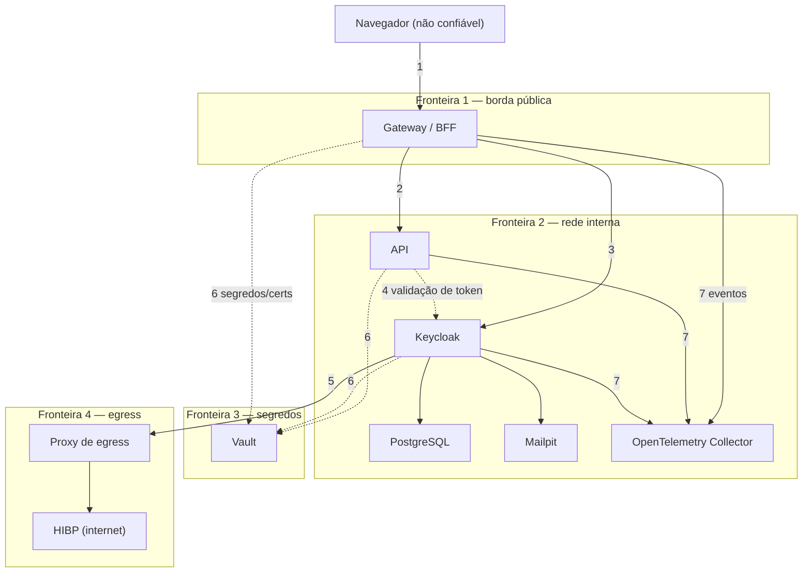

# Modelo de ameaças inicial

> Aplica STRIDE a cada fronteira de confiança da arquitetura alvo (ver [`docs/arquitetura.md`](arquitetura.md)). É o modelo **inicial**: cada change que altera uma fronteira ou introduz um componente atualiza a tabela de ameaças correspondente.

## Diagrama de fluxo de dados com fronteiras de confiança

## Tabela de ameaças

| ID | Fronteira/elemento | STRIDE | Ameaça | Controle planejado | Status |
|---|---|---|---|---|---|
| AM-01 | 1 — navegador → gateway | Spoofing | Sequestro de sessão por token/cookie roubado via XSS na página | Tokens nunca chegam ao navegador (BFF); cookie de sessão `HttpOnly`/`Secure` | Planejado (PRD-08) |
| AM-02 | 1 — navegador → gateway | Tampering | Requisição forjada por outro site (CSRF) em ações autenticadas | Header anti-CSRF obrigatório em `/api/*` e logout | Planejado (PRD-10) |
| AM-03 | 1 — navegador → gateway | Information Disclosure | Vazamento de dados de outra origem por CORS mal configurado | Nenhuma resposta do gateway inclui headers CORS; página same-origin | Planejado (PRD-10) |
| AM-04 | 1 — navegador → gateway | Denial of Service | Excesso de requisições de um cliente degrada o serviço | Rate limit por cliente no gateway | Planejado (PRD-10) |
| AM-05 | 2 — gateway → API | Elevation of Privilege | Acesso a conta de outro titular (IDOR) via `/api/accounts/{id}` | Verificação de titularidade na própria API, não só no gateway | Planejado (PRD-03) |
| AM-06 | 2 — gateway → API | Spoofing | Token forjado, de outro destinatário, ou com algoritmo inseguro aceito pela API | Validação completa de issuer, audience, algoritmo e nível de autenticação (`acr`) | Planejado (PRD-03, PRD-07) |
| AM-07 | 2 — rede interna | Information Disclosure | Erro interno detalhado exposto na resposta da API | Tratamento de erro que não vaza stack trace nem detalhe interno | Planejado (PRD-03) |
| AM-08 | 3 — gateway ↔ Keycloak | Spoofing | Comprometimento de um client secret estático usado indefinidamente | `private_key_jwt`: sem segredo compartilhado entre gateway e IdP | Planejado (PRD-08), ver [`0004-private-key-jwt`](adr/0004-private-key-jwt.md) |
| AM-09 | 3 — Keycloak | Spoofing / Repudiation | Login só com senha, sem segundo fator, ou recuperação de conta que dispensa o MFA | MFA obrigatório sem exceção; recuperação exige fator adicional | Planejado (PRD-07), ver [`0008-mfa-e-fatores-de-recuperacao`](adr/0008-mfa-e-fatores-de-recuperacao.md) |
| AM-10 | 3 — Keycloak | Spoofing | Credential stuffing ou password spraying contra o login | Bloqueio por força bruta; rejeição de senhas vazadas (HIBP) | Planejado (PRD-05, PRD-06) |
| AM-11 | 3 — Keycloak | Information Disclosure | Enumeração de contas por diferença de resposta em cadastro/login/recuperação | Respostas indistinguíveis para conta existente ou não | Planejado (PRD-05) |
| AM-12 | 3 — sessão | Repudiation / Tampering | Sessão que permanece válida após logout ou após ser encerrada pelo administrador no IdP | Back-channel logout invalidando a sessão no BFF imediatamente | Planejado (PRD-09) |
| AM-13 | 4 — segredos (Vault) | Information Disclosure | Segredo de um serviço acessível a outro serviço ou ao host | Vault Agent por serviço, entrega como arquivo, Vault não acessível do host | Planejado (PRD-04), ver [`0005-entrega-de-segredos-vault-agent`](adr/0005-entrega-de-segredos-vault-agent.md) |
| AM-14 | 5 — egress (HIBP) | Information Disclosure | Senha do usuário exposta ao consultar o HIBP | Apenas prefixo de hash enviado (k-anonimato); senha nunca sai do ambiente | Planejado (PRD-06) |
| AM-15 | 5 — egress (HIBP) | Denial of Service | Indisponibilidade do HIBP bloqueia todo cadastro/troca de senha | Falha aberta com piso local de senhas comuns | Planejado (PRD-06), ver [`0007-hibp-falha-aberta-com-piso-local`](adr/0007-hibp-falha-aberta-com-piso-local.md) |
| AM-16 | 6 — observabilidade | Information Disclosure | Dado sensível (token, senha, dado pessoal) exposto em log/evento | Vocabulário padronizado sem dados sensíveis; eventos revisados | Planejado (PRD-11) |
| AM-17 | 6 — observabilidade | Tampering | Injeção de linha forjada em log para mascarar uma ação maliciosa | Eventos estruturados (não texto livre concatenado) | Planejado (PRD-11) |
| AM-18 | Repositório — branch principal | Tampering | Controle implementado é removido ou alterado silenciosamente por mudança futura | Ruleset sem bypass, PR obrigatório, commits assinados, checks obrigatórios | Implementado, ver [`0013-governanca-mantenedor-unico`](adr/0013-governanca-mantenedor-unico.md) |
| AM-19 | Repositório — push | Information Disclosure | Segredo commitado por engano chega ao histórico do repositório | Secret scanning com push protection | Planejado (GOV-04) |
| AM-20 | Pipeline CI | Elevation of Privilege | Workflow de CI com permissão para alterar configuração do repositório | Nenhum workflow tem permissão de administração; ruleset aplicado só localmente | Implementado (GOV-11) |
| AM-21 | Pipeline CI | Tampering | Action de terceiro comprometida (tag movida ou pacote sequestrado) executa código arbitrário no runner | Toda action pinada por SHA completo, exigido pela configuração do repositório; CodeQL para `actions` bloqueia action não pinada | Implementado (`SUP-01`) |
| AM-22 | NuGet | Supply Chain | Pacote malicioso publicado recentemente sob nome semelhante a um pacote legítimo (typosquatting/dependency confusion) | `nuget.config` com fonte única mapeada (`SUP-10`); cooldown de 7 dias no Dependabot antes de propor versão recém-publicada (`SUP-06`) | Implementado (`SUP-06`, `SUP-10`) |
| AM-23 | NuGet | Information Disclosure / Tampering | Dependência (direta ou transitiva) com vulnerabilidade conhecida publicada | NuGetAudit falha o build em qualquer vulnerabilidade conhecida; auditoria diária do branch principal | Implementado (`SUP-11`, `SUP-13`) |
| AM-24 | Pipeline CI — PR | Elevation of Privilege | Código não confiável de um PR roda com token de escrita elevado (`pull_request_target` mal usado) | Nenhum workflow usa `pull_request_target` para checkout/execução de código do PR | Implementado (`SUP-03`) |
| AM-25 | NuGet | Tampering | Pacote resolvido de uma fonte inesperada (fonte de máquina/usuário não intencional) | `nuget.config` com `<clear/>` e `packageSourceMapping` restrito a nuget.org | Implementado (`SUP-10`) |

## Riscos aceitos globais

Riscos que o projeto decide conscientemente não eliminar, por não haver mitigação proporcional ao escopo de um projeto de estudo:

- **Mantenedor único, sem segregação entre autor e revisor:** a revisão humana do código, inclusive gerado por IA, é atestada apenas pela assinatura de commit do mantenedor. Não há um segundo revisor que aprove PRs. Ver [`0013-governanca-mantenedor-unico`](adr/0013-governanca-mantenedor-unico.md).
- **Deriva do ruleset versionado:** o ruleset real no GitHub pode divergir do JSON versionado entre uma mudança no arquivo e a reaplicação manual do script pelo mantenedor. Não há verificação automatizada de deriva.
- **Segredo inicial do Vault Agent:** o AppRole usado pelo Vault Agent para se autenticar no Vault na subida do compose é reduzido (wrapping de uso único, TTL curto), não eliminado.
- **Instância única do gateway:** sessões e contadores de rate limit são perdidos em um restart; não há sessão distribuída nem alta disponibilidade.
- **NuGetAudit com build quebrável por CVE nova:** uma vulnerabilidade recém-publicada em uma dependência pode quebrar o build sem nenhuma mudança de código no projeto.
- **HIBP em falha aberta:** durante uma indisponibilidade do serviço, uma senha vazada ausente do piso local pode ser aceita. Ver [`0007-hibp-falha-aberta-com-piso-local`](adr/0007-hibp-falha-aberta-com-piso-local.md).
- **Concorrência na renovação de token no BFF:** cenários de corrida durante a renovação de token não são tratados com um mecanismo de lock explícito.
- **E2E agendado, não por PR:** uma regressão de fluxo é descoberta com atraso de até um ciclo de agendamento. Ver [`0012-e2e-agendado-sem-dast`](adr/0012-e2e-agendado-sem-dast.md).
- **Repositório público:** traces e artefatos de CI ficam visíveis publicamente (dados efêmeros de ambiente de teste, sem informação real).
- **Push protection contornável:** cobre apenas padrões de alta confiança e o autor do push pode optar por ignorar o bloqueio; o bypass gera alerta, mas não impede o push.
- **Scorecard Code-Review pontua baixo:** mantenedor único, sem um segundo revisor que aprove PRs.
- **Scorecard Branch-Protection pontua parcialmente:** ler o ruleset completo exigiria um PAT de administração salvo como secret, o que contraria a governança de token de vida curta (`GOV-11`).
- **Dependency review quase cego para NuGet sob Central Package Management:** o dependency graph reporta versões de pacote NuGet como `>= 0`; a cobertura efetiva de NuGet vem do NuGetAudit no build (`SUP-11`) e na auditoria diária (`SUP-13`).
- **Workflows agendados são desabilitados após 60 dias sem atividade no repositório:** o GitHub avisa antes de desabilitar, e qualquer commit reabilita.
- **Sem licença:** todos os direitos reservados por padrão; o check de License do Scorecard pontua zero.
- **CodeQL em `build-mode: none` para C# ignora lock files** e pode não alcançar código que só existe após uma build real; reavaliar para `manual` se surgirem lacunas de extração.
- **Dependabot pode propor uma versão incompatível apesar da regra `ignore`** (limitação conhecida do dependabot-core, [#8183](https://github.com/dependabot/dependabot-core/issues/8183)): o build falha (`NU1202` ou erro de compilação) e a PR não mescla; o mantenedor a fecha.
- **Syft é baixado em tempo de execução pela `anchore/sbom-action`:** a action é pinada por SHA e a versão do Syft é explícita, mas não há verificação independente do binário baixado.

## Manutenção deste documento

Cada change que introduz ou altera um componente, fluxo ou fronteira atualiza a tabela de ameaças correspondente e, se necessário, o diagrama. Uma ameaça mitigada tem seu status atualizado para "Implementado" com um link para a evidência (controle, teste ou configuração), seguindo o mesmo princípio de rastreabilidade da matriz ASVS.
